# HireHub - AI 채용 플랫폼

AWS 클라우드 네이티브 기술을 활용한 AI 기반 채용 플랫폼 데모 애플리케이션

---

## 🚀 데모 현황 (Demo Status)

> **Last Updated:** 2026-01-12

### 배포 완료 인프라

```
┌─────────────────────────────────────────────────────────────────┐
│                    HireHub Demo Infrastructure                   │
├─────────────────────────────────────────────────────────────────┤
│  EKS Cluster: demo-hirehub-eks (v1.34, AL2023)                  │
│  ├── Nodes: 2x t3.medium (Spot)                                 │
│  ├── ArgoCD: Deployed (Kong app configured)                     │
│  ├── Kong Gateway: Running (Internal NLB)                       │
│  └── Add-ons: kube-proxy, vpc-cni, coredns (latest)             │
├─────────────────────────────────────────────────────────────────┤
│  ECR Images: 7/7 services built                                 │
│  ├── user-service (Go)          ✅                              │
│  ├── job-service (Java)         ✅                              │
│  ├── resume-service (Python)    ✅                              │
│  ├── apply-service (Go)         ✅                              │
│  ├── match-service (Python)     ✅                              │
│  ├── ai-service (Python)        ✅                              │
│  └── notification-service (Go)  ✅                              │
├─────────────────────────────────────────────────────────────────┤
│  AI/ML Features                                                 │
│  ├── RAG API: /api/v1/rag/query, /index, /delete               │
│  ├── PII Removal: QWEN3 sLLM integration                       │
│  └── AgentCore: Bedrock Agent matching                         │
├─────────────────────────────────────────────────────────────────┤
│  ArgoCD Applications (Ready to Deploy)                          │
│  ├── observability (kube-prometheus-stack)                      │
│  ├── karpenter (Node auto-scaling)                              │
│  └── keda (Event-driven pod scaling)                            │
├─────────────────────────────────────────────────────────────────┤
│  DR Infrastructure                                              │
│  ├── Lambda Failover Function (Terraform module)               │
│  └── ALB Weighted Target Groups                                │
└─────────────────────────────────────────────────────────────────┘
```

### 버전 정보

| Component | Version | Note |
|-----------|---------|------|
| EKS | **1.34** | Latest (2026-01) |
| Node AMI | AL2023 | Amazon Linux 2023 |
| Kubernetes | v1.34.2-eks | Nodes |
| kube-proxy | v1.34.1 | Add-on |
| vpc-cni | v1.21.1 | Add-on |
| coredns | v1.12.4 | Add-on |
| containerd | 2.1.5 | Runtime |
| Terraform AWS | >= 6.0 | Provider |

### 접속 정보

```bash
# EKS kubeconfig 설정
aws eks update-kubeconfig --name demo-hirehub-eks --region ap-northeast-2

# 클러스터 상태 확인
kubectl get nodes
kubectl get pods -A

# ArgoCD 접속 (Port Forward)
kubectl port-forward svc/argocd-server -n argocd 8080:443
# URL: https://localhost:8080
# Username: admin
# Password: kubectl get secret argocd-initial-admin-secret -n argocd -o jsonpath="{.data.password}" | base64 -d
```

---

## 주요 기능

| 기능 | 설명 |
|------|------|
| **AI 이력서 분석** | PDF/Word 이력서 업로드 → RAG 기반 분석 → JD 매칭 |
| **PII 자동 마스킹** | sLLM(QWEN3)으로 개인정보(이름, 연락처, 주민번호) 자동 제거 |
| **스마트 매칭** | AgentCore 기반 구직자-채용공고 AI 매칭 |
| **실시간 알림** | MSK를 통한 지원/면접/합격 알림 |
| **소셜 로그인** | Cognito + Google/Kakao/Naver 연동 |

---

## 서비스 아키텍처

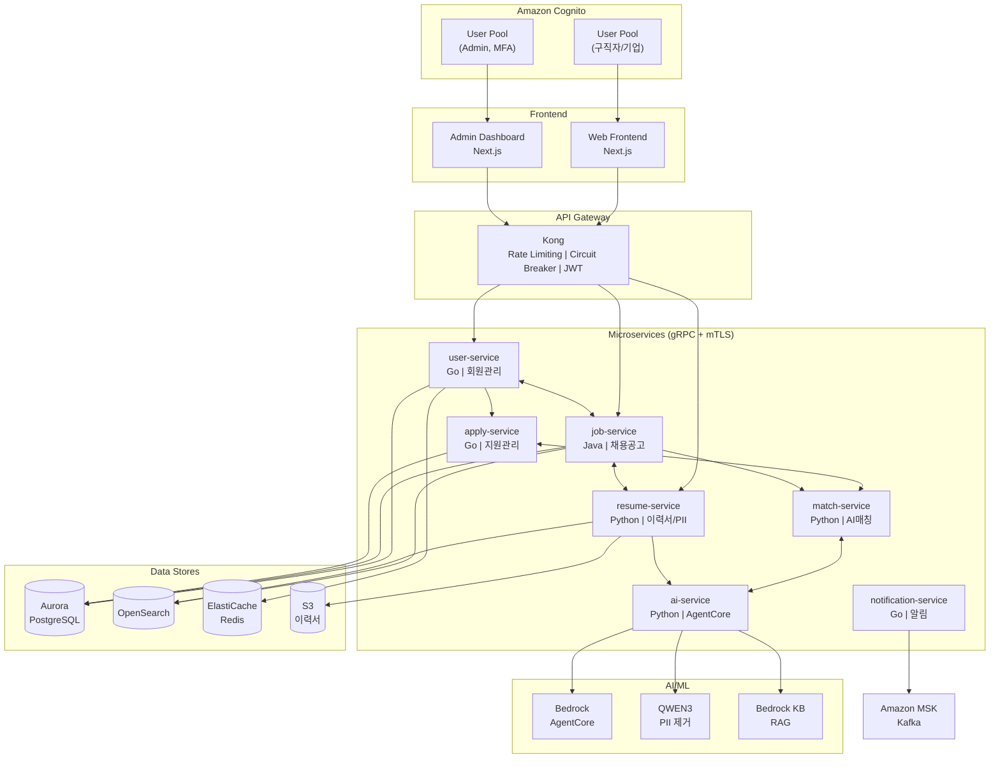

---

## 마이크로서비스 구성

| 서비스 | 포트 | 기술 스택 | 역할 |
|--------|------|----------|------|
| `user-service` | 8001 | Go + gRPC | 회원 관리 (구직자/기업/어드민) |
| `job-service` | 8002 | Java + Spring Boot + gRPC | 채용공고 CRUD, 검색 |
| `resume-service` | 8003 | Python + FastAPI | 이력서 업로드, PII 제거, 파싱 |
| `apply-service` | 8004 | Go + gRPC | 지원 관리, 상태 추적 |
| `match-service` | 8005 | Python + FastAPI | AI 매칭 엔진 |
| `ai-service` | 8006 | Python + FastAPI | AgentCore, RAG, sLLM |
| `notification-service` | 8007 | Go + Kafka | 알림 발송 (이메일/푸시/SMS) |
| `admin-dashboard` | 3000 | Next.js | 어드민 대시보드 |
| `web-frontend` | 3001 | Next.js | 사용자 웹앱 |

---

## 인프라 구성

### Container Orchestration (EKS + ECS DR)

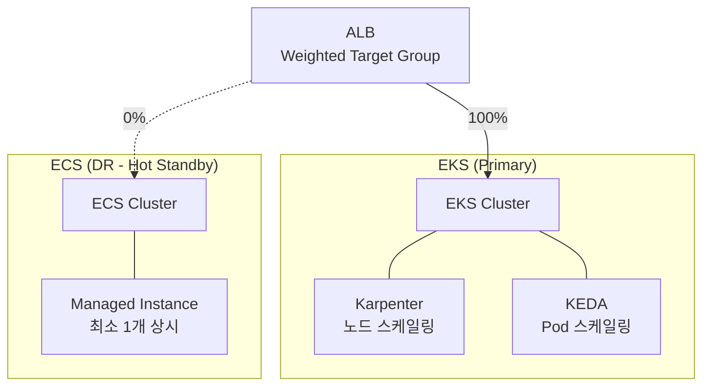

| 모드 | EKS | ECS | 설명 |
|------|-----|-----|------|
| Normal | 100% | 0% | 평상시 운영 |
| DR | 0% | 100% | 장애 전환 |
| Canary | 90% | 10% | 점진적 복구 |

### Data Stores
- **Aurora PostgreSQL**: 사용자, 채용공고, 지원 데이터
- **Amazon OpenSearch**: 채용공고/이력서 풀텍스트 검색
- **ElastiCache Redis**: 세션, 캐싱
- **S3**: 이력서 파일 저장

### AI/ML
- **Amazon Bedrock**: AgentCore 기반 AI Agent
- **QWEN3 on EKS**: PII 제거용 sLLM (vLLM 서빙)
- **Bedrock Knowledge Base**: 이력서 RAG

### Messaging & Auth
- **Amazon MSK**: Kafka 기반 이벤트 스트리밍
- **Amazon Cognito**: 인증/인가
  - **User Pool (일반)**: 구직자/기업 회원 + 소셜 로그인 (Google, Kakao, Naver)
  - **User Pool (Admin)**: 관리자 전용, MFA 필수, 소셜 로그인 미지원

### Observability
| 영역 | 도구 |
|------|------|
| Metrics | Prometheus + CloudWatch |
| Tracing | AWS X-Ray (ADOT) |
| Logging | CloudWatch Logs + Fluent Bit |
| Dashboard | Grafana + CloudWatch |

### API Gateway
- **Kong Gateway**: API Gateway, Rate Limiting, Circuit Breaker, Auth (JWT/OAuth2)
  - DB-less 모드 (선언적 구성)
  - Kong Ingress Controller로 K8s 네이티브 통합
  - ArgoCD를 통한 GitOps 배포

### GitOps (ArgoCD)

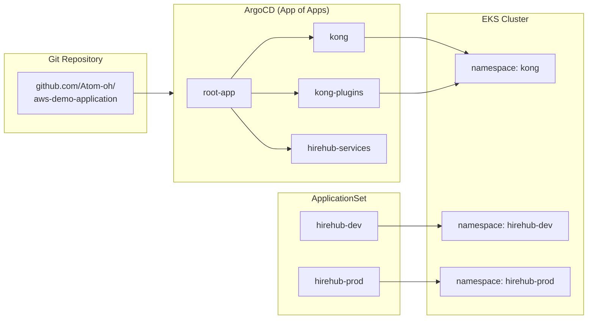

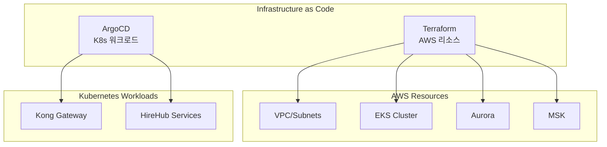

| 구분 | 도구 | 경로 |
|------|------|------|
| AWS 인프라 | Terraform | `infrastructure/terraform/` |
| EKS Addons | Terraform | EKS Blueprint addons |
| K8s 워크로드 | ArgoCD | `infrastructure/argocd/` |
| Helm Charts | Helm | `infrastructure/helm/` |

---

## 학습 토픽 (Learning Topics)

이 프로젝트에서 학습할 수 있는 AWS 클라우드 네이티브 기술들:

### 1. Advanced RAG (Retrieval-Augmented Generation)

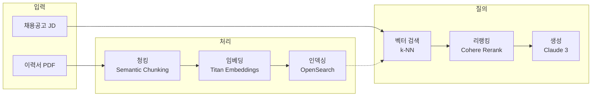

| 구성요소 | 기술 | 설명 |
|---------|------|------|
| 벡터 DB | OpenSearch + k-NN | 이력서 임베딩 저장/검색 |
| 임베딩 | Amazon Titan | 텍스트 → 벡터 변환 |
| Knowledge Base | Bedrock KB | 관리형 RAG 파이프라인 |
| 청킹 전략 | Semantic Chunking | 의미 단위 분할 |

**학습 포인트:**
- 청크 크기와 오버랩 최적화
- 하이브리드 검색 (키워드 + 벡터)
- 컨텍스트 윈도우 활용 전략

### 2. LLM 기반 PII 제거 (sLLM)

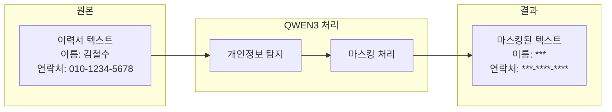

| 구성요소 | 기술 | 설명 |
|---------|------|------|
| 모델 | QWEN3-7B | 한국어 PII 탐지 최적화 |
| 서빙 | vLLM on EKS | GPU 추론 서버 |
| 탐지 대상 | 이름, 연락처, 주민번호, 주소 | 한국 개인정보보호법 준수 |

**학습 포인트:**
- sLLM vs API 기반 LLM 비용/성능 비교
- vLLM 배치 추론 최적화
- 프롬프트 엔지니어링 (Few-shot, CoT)

### 3. MSA 아키텍처 with EKS

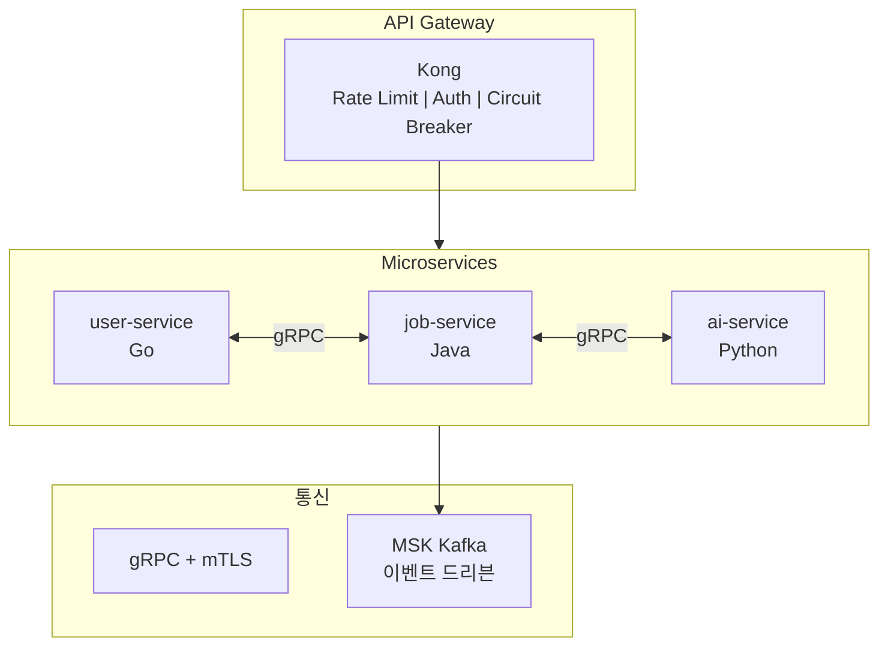

| 패턴 | 구현 | 설명 |
|------|------|------|
| API Gateway | Kong + Ingress Controller | 트래픽 관리, 인증 |
| Service Mesh | gRPC + mTLS | 서비스간 보안 통신 |
| Event-Driven | MSK Kafka | 비동기 이벤트 처리 |
| GitOps | ArgoCD | 선언적 배포 |

**학습 포인트:**
- gRPC vs REST 트레이드오프
- Circuit Breaker 패턴 (Kong)
- GitOps 배포 전략 (Blue-Green, Canary)

### 4. Observability Stack (LGTM + Multi-Backend)

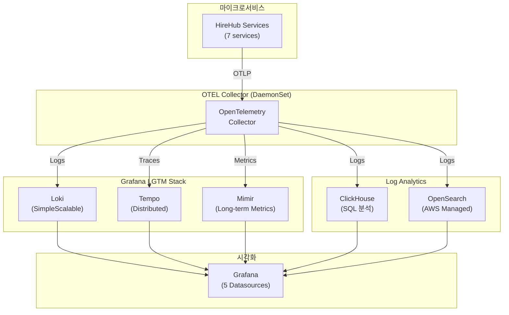

**LGTM Stack 구성:**
| Component | 역할 | 쿼리 언어 |
|-----------|------|----------|
| **L**oki | 로그 수집/저장 | LogQL |
| **G**rafana | 통합 시각화 | - |
| **T**empo | 분산 트레이싱 | TraceQL |
| **M**imir | 장기 메트릭 저장 | PromQL |

**멀티 백엔드 로그 분석:**
| 백엔드 | 용도 | 장점 |
|--------|------|------|
| Loki | 실시간 로그 | K8s 네이티브, 경량 |
| ClickHouse | SQL 분석 | 초고속 집계 쿼리 |
| OpenSearch | Full-text 검색 | 복잡한 검색 조건 |

**Grafana Datasources:**
```yaml
datasources:
  - Loki        # LogQL 기반 로그 검색
  - Tempo       # TraceQL 기반 트레이싱
  - Mimir       # PromQL 기반 메트릭
  - ClickHouse  # SQL 기반 로그 분석
  - OpenSearch  # Full-text 검색
```

**학습 포인트:**
- OTEL Collector Fan-out 패턴 (1:N 데이터 분배)
- Loki SimpleScalable vs Monolithic 아키텍처
- Tempo와 Loki 연동 (TraceID 기반 로그-트레이스 상관관계)
- Mimir vs Prometheus 비교 (확장성, 장기 저장)
- ClickHouse vs Loki vs OpenSearch 쿼리 성능 비교

### 5. Auto Scaling (Karpenter + KEDA)

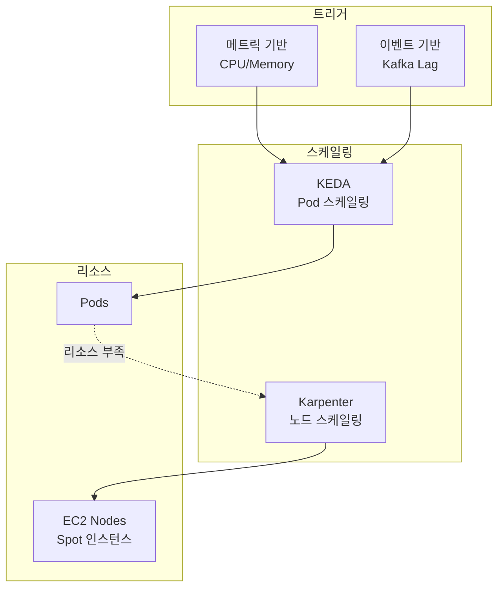

| 레이어 | 도구 | 스케일링 기준 |
|--------|------|--------------|
| Pod | KEDA | Kafka Consumer Lag, HTTP 요청수 |
| Node | Karpenter | Pending Pod 리소스 요청 |

**Karpenter 구성:**
```yaml
# NodePool 예시
apiVersion: karpenter.sh/v1
kind: NodePool
spec:
  template:
    spec:
      requirements:
        - key: karpenter.sh/capacity-type
          operator: In
          values: ["spot", "on-demand"]
        - key: node.kubernetes.io/instance-type
          operator: In
          values: ["m5.large", "m5.xlarge"]
```

**KEDA ScaledObject:**
```yaml
apiVersion: keda.sh/v1alpha1
kind: ScaledObject
spec:
  scaleTargetRef:
    name: notification-service
  triggers:
    - type: kafka
      metadata:
        topic: notifications
        lagThreshold: "100"
```

**학습 포인트:**
- Karpenter vs Cluster Autoscaler 비교
- Spot Instance 중단 처리
- KEDA 외부 스케일러 (Kafka, AWS SQS)

### 6. DR Architecture (ECS Hot Standby)

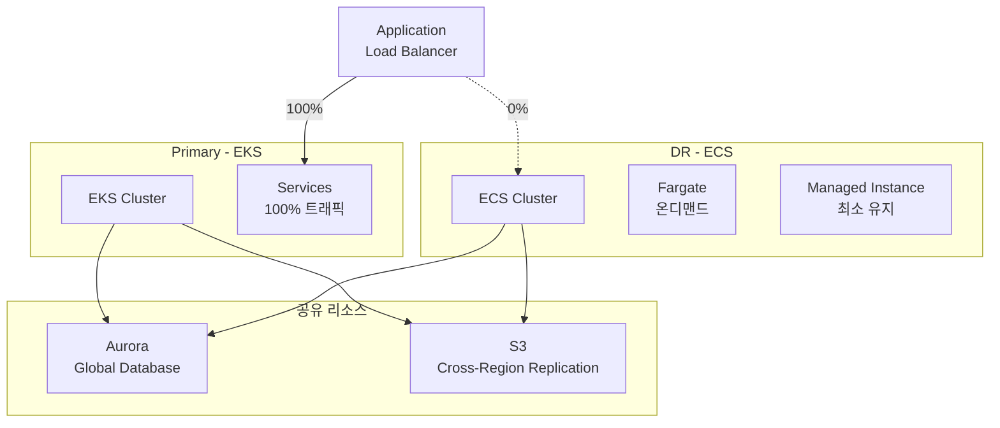

| 구성 | EKS (Primary) | ECS (DR) |
|------|--------------|----------|
| 역할 | 메인 운영 | Hot Standby |
| 스케일링 | Karpenter + KEDA | Fargate Auto Scaling |
| 비용 | Spot 인스턴스 활용 | 최소 Managed Instance 유지 |

**학습 포인트:**
- EKS vs ECS 아키텍처 차이
- Fargate vs EC2 Launch Type 비교
- RTO/RPO 목표에 따른 DR 전략

### 7. DR Failover Automation

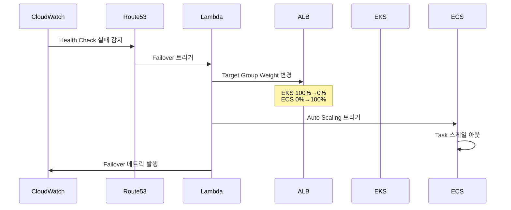

**Lambda Failover 함수:**
```python
def lambda_handler(event, context):
    # ALB Target Group Weight 변경
    elbv2.modify_rule(
        RuleArn=rule_arn,
        Actions=[{
            'Type': 'forward',
            'ForwardConfig': {
                'TargetGroups': [
                    {'TargetGroupArn': eks_tg, 'Weight': 0},
                    {'TargetGroupArn': ecs_tg, 'Weight': 100}
                ]
            }
        }]
    )
```

| 구성요소 | 역할 |
|---------|------|
| Route53 Health Check | EKS 엔드포인트 상태 모니터링 |
| CloudWatch Alarm | 장애 감지 및 Lambda 트리거 |
| Lambda | ALB Rule 수정, ECS 스케일 아웃 |
| ALB Weighted Routing | 트래픽 분배 (100:0 → 0:100) |

**학습 포인트:**
- Route53 Failover Routing vs ALB Weighted Routing
- Lambda 기반 자동화 vs Step Functions
- 장애 복구 테스트 (Chaos Engineering)

---

## 프로젝트 구조

```
demo/
├── services/
│   ├── user-service/         # Go
│   ├── job-service/          # Java (Spring Boot)
│   ├── resume-service/       # Python
│   ├── apply-service/        # Go
│   ├── match-service/        # Python
│   ├── ai-service/           # Python
│   └── notification-service/ # Go
├── frontend/
│   ├── web/                  # Next.js (사용자)
│   └── admin/                # Next.js (어드민)
├── infrastructure/
│   ├── terraform/            # AWS 인프라 (Terraform)
│   ├── helm/                 # Kubernetes Helm Charts
│   ├── argocd/               # ArgoCD Applications (GitOps)
│   │   ├── install/          # ArgoCD 설치 values
│   │   ├── projects/         # AppProject 정의
│   │   ├── applications/     # Application manifests
│   │   ├── applicationsets/  # Multi-env ApplicationSet
│   │   └── kong-plugins/     # Kong CRD manifests
│   └── k8s/                  # Kustomize 베이스
├── proto/                    # gRPC Proto 정의
├── scripts/
│   ├── mock-data/            # Mock data 생성 스크립트
│   │   ├── seed.py           # 메인 시더
│   │   ├── generators/       # 데이터 생성기
│   │   └── resumes/          # 샘플 이력서 PDF
│   └── utils/                # 유틸리티 스크립트
└── docs/                     # 문서
```

---

## 핵심 시나리오

### 1. 이력서 업로드 → PII 제거 → AI 분석

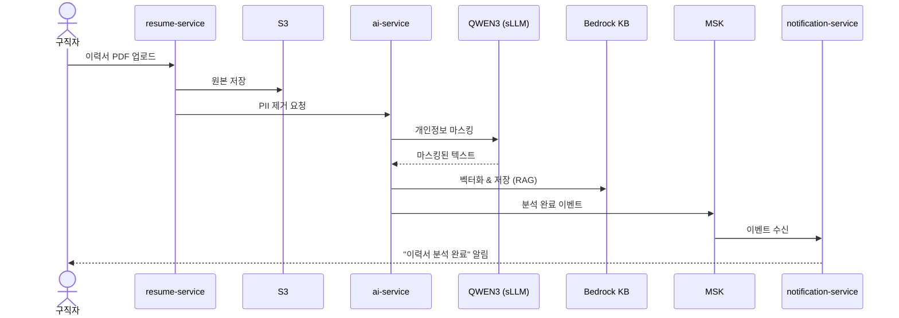

### 2. 채용공고 등록 → AI 매칭 → 추천

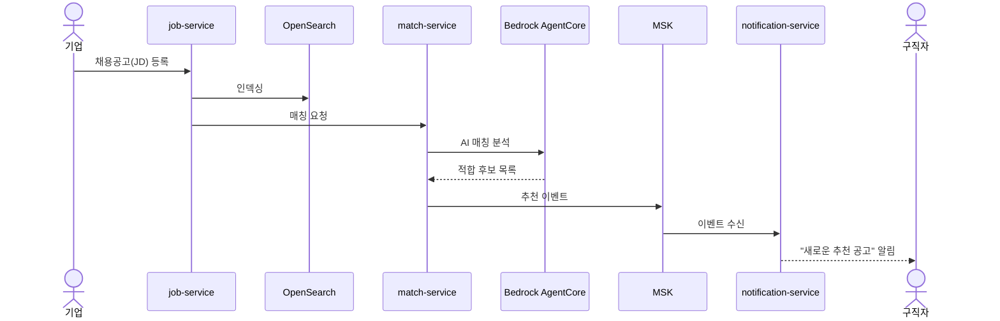

### 3. 지원 → 상태 추적 → 알림

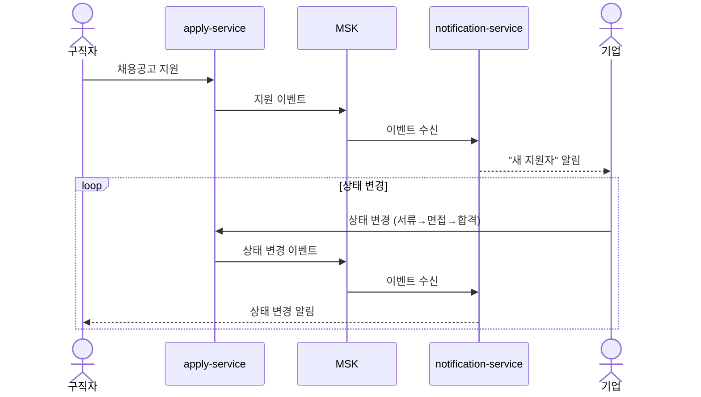

### 4. DR 전환 (EKS → ECS)

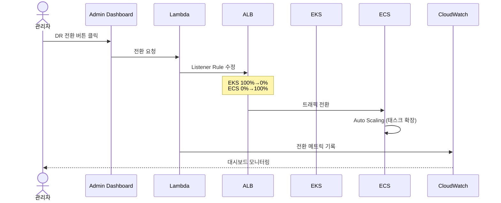

---

## Mock Data

데모용 샘플 데이터 자동 생성

### 데이터 구성

| 엔티티 | 수량 | 설명 |
|--------|------|------|
| **구직자** | 500명 | 다양한 경력/스킬셋 |
| **기업** | 50개 | 스타트업 ~ 대기업 |
| **채용공고** | 200개 | 개발/기획/디자인 등 |
| **이력서** | 500개 | PDF 샘플 포함 |
| **지원내역** | 1,000건 | 다양한 상태 (서류검토/면접/합격/불합격) |

### 샘플 데이터 예시

```json
// 구직자
{
  "id": "user-001",
  "name": "김개발",
  "email": "dev.kim@example.com",
  "skills": ["Go", "Kubernetes", "AWS"],
  "experience_years": 5,
  "desired_position": "Backend Engineer",
  "desired_salary": 7000
}

// 기업
{
  "id": "company-001",
  "name": "테크스타트업",
  "industry": "IT/소프트웨어",
  "size": "50-100명",
  "location": "서울 강남구"
}

// 채용공고
{
  "id": "job-001",
  "company_id": "company-001",
  "title": "Senior Backend Engineer",
  "skills_required": ["Go", "gRPC", "Kubernetes"],
  "experience_min": 3,
  "salary_range": {"min": 6000, "max": 9000},
  "status": "open"
}

// 이력서 (PII 마스킹 후)
{
  "id": "resume-001",
  "user_id": "user-001",
  "original_file": "s3://resumes/user-001.pdf",
  "masked_content": "이름: ***  연락처: ***-****-****\n경력: 5년\n기술: Go, Kubernetes...",
  "extracted_skills": ["Go", "Kubernetes", "AWS", "Docker"],
  "ai_summary": "5년차 백엔드 개발자, 클라우드 인프라 경험 풍부..."
}
```

### Mock Data 생성

```bash
# 전체 mock data 생성
make seed-all

# 개별 생성
make seed-users      # 구직자/기업 사용자
make seed-companies  # 기업 정보
make seed-jobs       # 채용공고
make seed-resumes    # 이력서 (PDF 생성 포함)
make seed-applies    # 지원내역

# Mock data 초기화
make seed-reset
```

### 이력서 PDF 샘플

`scripts/mock-data/resumes/` 디렉토리에 다양한 형태의 샘플 이력서 PDF 포함:
- 신입 이력서 (경력 0-2년)
- 경력 이력서 (3-7년)
- 시니어 이력서 (8년+)
- 다양한 직군 (개발/기획/디자인/마케팅)

---

## AWS 배포

### Prerequisites
- AWS CLI configured
- Terraform >= 1.5
- kubectl
- Docker

### 1. Terraform으로 인프라 배포

```bash
cd infrastructure/terraform/deploy
terraform init
terraform plan
terraform apply

# EKS kubeconfig 설정
aws eks update-kubeconfig --name demo-hirehub-eks --region ap-northeast-2
```

### 2. ArgoCD 설치 및 GitOps 설정

```bash
# ArgoCD 설치
kubectl create namespace argocd
kubectl apply -n argocd -f https://raw.githubusercontent.com/argoproj/argo-cd/stable/manifests/install.yaml

# ArgoCD Applications 배포
kubectl apply -f infrastructure/argocd/applications/kong.yaml
```

### 3. Docker 이미지 빌드 및 ECR 푸시

```bash
# ECR 로그인
aws ecr get-login-password --region ap-northeast-2 | docker login --username AWS --password-stdin 180294183052.dkr.ecr.ap-northeast-2.amazonaws.com

# 전체 서비스 빌드 및 푸시
./build-all.sh
```

### Security 고려사항

| 항목 | 설정 |
|------|------|
| **Kong NLB** | Internal scheme (VPC 내부만 접근) |
| **외부 접근** | CloudFront → ALB → Kong |
| **CloudFront SG** | AWS Managed Prefix List 사용 |
| **IAM** | Pod Identity (IRSA 대신 권장) |
| **DB 접근** | Private Subnet, NAT Gateway만 |

---

## 로컬 개발 환경

```bash
# 의존성 설치 (Docker, kubectl, helm 필요)
make setup

# 로컬 Kubernetes (Kind) 클러스터 생성
make cluster-up

# 모든 서비스 배포
make deploy-all

# 개별 서비스 실행
make run-user-service
make run-ai-service

# 테스트
make test-all
```

---

## 라이선스

MIT License
