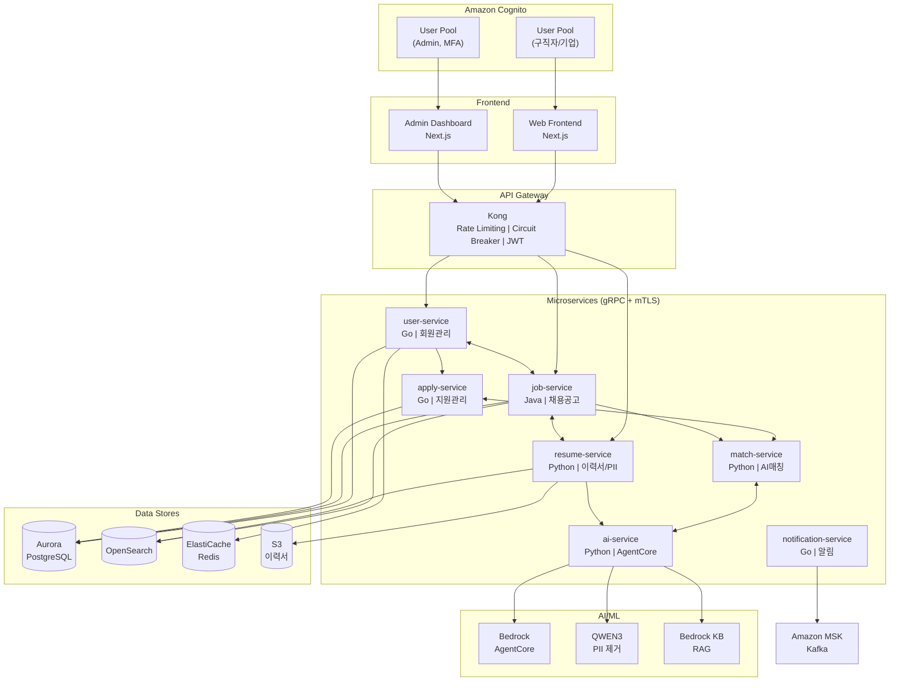
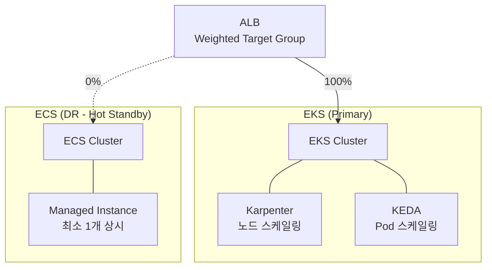
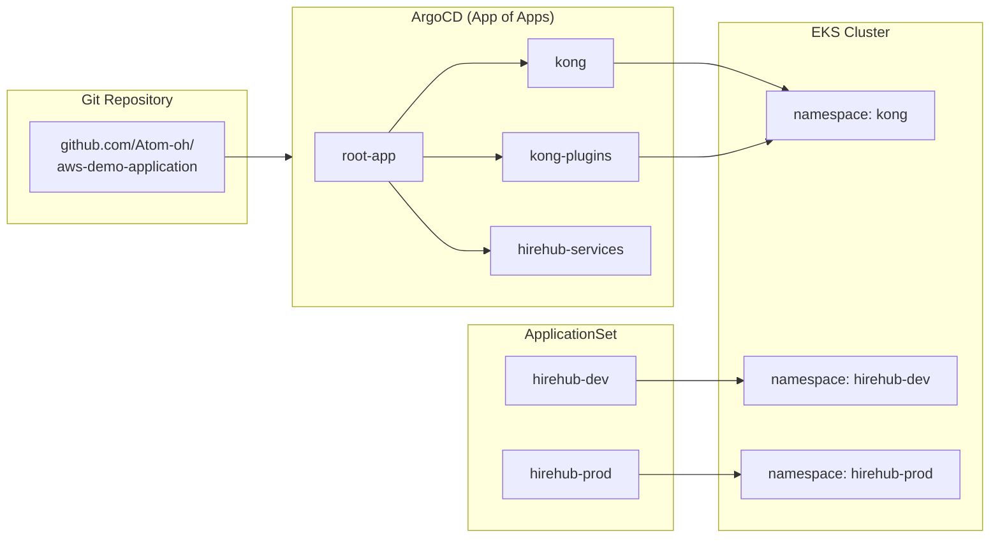
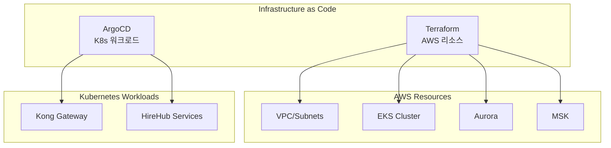
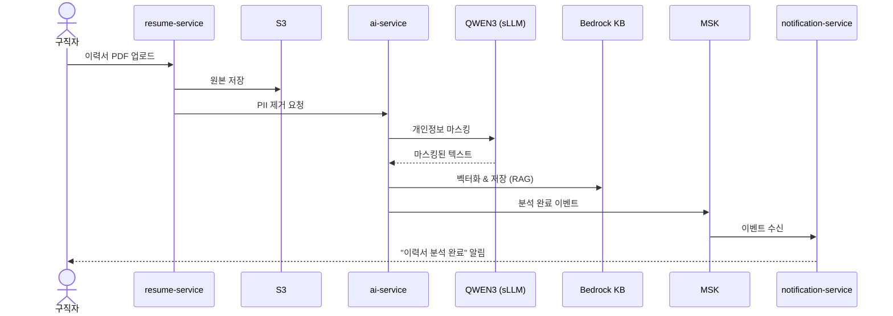
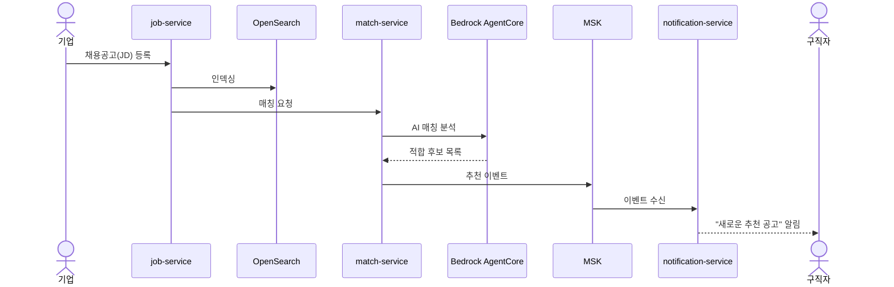
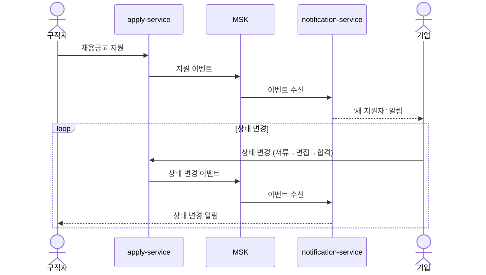
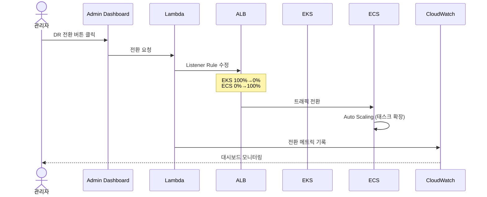

# HireHub - AI 채용 플랫폼

AWS 클라우드 네이티브 기술을 활용한 AI 기반 채용 플랫폼 데모 애플리케이션

## 주요 기능

| 기능 | 설명 |
|------|------|
| **AI 이력서 분석** | PDF/Word 이력서 업로드 → RAG 기반 분석 → JD 매칭 |
| **PII 자동 마스킹** | sLLM(QWEN3)으로 개인정보(이름, 연락처, 주민번호) 자동 제거 |
| **스마트 매칭** | AgentCore 기반 구직자-채용공고 AI 매칭 |
| **실시간 알림** | MSK를 통한 지원/면접/합격 알림 |
| **소셜 로그인** | Cognito + Google/Kakao/Naver 연동 |

---

## 서비스 아키텍처



---

## 마이크로서비스 구성

| 서비스 | 포트 | 기술 스택 | 역할 |
|--------|------|----------|------|
| `user-service` | 8001 | Go + gRPC | 회원 관리 (구직자/기업/어드민) |
| `job-service` | 8002 | Java + Spring Boot + gRPC | 채용공고 CRUD, 검색 |
| `resume-service` | 8003 | Python + FastAPI | 이력서 업로드, PII 제거, 파싱 |
| `apply-service` | 8004 | Go + gRPC | 지원 관리, 상태 추적 |
| `match-service` | 8005 | Python + FastAPI | AI 매칭 엔진 |
| `ai-service` | 8006 | Python + FastAPI | AgentCore, RAG, sLLM |
| `notification-service` | 8007 | Go + Kafka | 알림 발송 (이메일/푸시/SMS) |
| `admin-dashboard` | 3000 | Next.js | 어드민 대시보드 |
| `web-frontend` | 3001 | Next.js | 사용자 웹앱 |

---

## 인프라 구성

### Container Orchestration (EKS + ECS DR)



| 모드 | EKS | ECS | 설명 |
|------|-----|-----|------|
| Normal | 100% | 0% | 평상시 운영 |
| DR | 0% | 100% | 장애 전환 |
| Canary | 90% | 10% | 점진적 복구 |

### Data Stores
- **Aurora PostgreSQL**: 사용자, 채용공고, 지원 데이터
- **Amazon OpenSearch**: 채용공고/이력서 풀텍스트 검색
- **ElastiCache Redis**: 세션, 캐싱
- **S3**: 이력서 파일 저장

### AI/ML
- **Amazon Bedrock**: AgentCore 기반 AI Agent
- **QWEN3 on EKS**: PII 제거용 sLLM (vLLM 서빙)
- **Bedrock Knowledge Base**: 이력서 RAG

### Messaging & Auth
- **Amazon MSK**: Kafka 기반 이벤트 스트리밍
- **Amazon Cognito**: 인증/인가
  - **User Pool (일반)**: 구직자/기업 회원 + 소셜 로그인 (Google, Kakao, Naver)
  - **User Pool (Admin)**: 관리자 전용, MFA 필수, 소셜 로그인 미지원

### Observability
| 영역 | 도구 |
|------|------|
| Metrics | Prometheus + CloudWatch |
| Tracing | AWS X-Ray (ADOT) |
| Logging | CloudWatch Logs + Fluent Bit |
| Dashboard | Grafana + CloudWatch |

### API Gateway
- **Kong Gateway**: API Gateway, Rate Limiting, Circuit Breaker, Auth (JWT/OAuth2)
  - DB-less 모드 (선언적 구성)
  - Kong Ingress Controller로 K8s 네이티브 통합
  - ArgoCD를 통한 GitOps 배포

### GitOps (ArgoCD)





| 구분 | 도구 | 경로 |
|------|------|------|
| AWS 인프라 | Terraform | `infrastructure/terraform/` |
| EKS Addons | Terraform | EKS Blueprint addons |
| K8s 워크로드 | ArgoCD | `infrastructure/argocd/` |
| Helm Charts | Helm | `infrastructure/helm/` |

---

## 프로젝트 구조

```
demo/
├── services/
│   ├── user-service/         # Go
│   ├── job-service/          # Java (Spring Boot)
│   ├── resume-service/       # Python
│   ├── apply-service/        # Go
│   ├── match-service/        # Python
│   ├── ai-service/           # Python
│   └── notification-service/ # Go
├── frontend/
│   ├── web/                  # Next.js (사용자)
│   └── admin/                # Next.js (어드민)
├── infrastructure/
│   ├── terraform/            # AWS 인프라 (Terraform)
│   ├── helm/                 # Kubernetes Helm Charts
│   ├── argocd/               # ArgoCD Applications (GitOps)
│   │   ├── install/          # ArgoCD 설치 values
│   │   ├── projects/         # AppProject 정의
│   │   ├── applications/     # Application manifests
│   │   ├── applicationsets/  # Multi-env ApplicationSet
│   │   └── kong-plugins/     # Kong CRD manifests
│   └── k8s/                  # Kustomize 베이스
├── proto/                    # gRPC Proto 정의
├── scripts/
│   ├── mock-data/            # Mock data 생성 스크립트
│   │   ├── seed.py           # 메인 시더
│   │   ├── generators/       # 데이터 생성기
│   │   └── resumes/          # 샘플 이력서 PDF
│   └── utils/                # 유틸리티 스크립트
└── docs/                     # 문서
```

---

## 핵심 시나리오

### 1. 이력서 업로드 → PII 제거 → AI 분석



### 2. 채용공고 등록 → AI 매칭 → 추천



### 3. 지원 → 상태 추적 → 알림



### 4. DR 전환 (EKS → ECS)



---

## Mock Data

데모용 샘플 데이터 자동 생성

### 데이터 구성

| 엔티티 | 수량 | 설명 |
|--------|------|------|
| **구직자** | 500명 | 다양한 경력/스킬셋 |
| **기업** | 50개 | 스타트업 ~ 대기업 |
| **채용공고** | 200개 | 개발/기획/디자인 등 |
| **이력서** | 500개 | PDF 샘플 포함 |
| **지원내역** | 1,000건 | 다양한 상태 (서류검토/면접/합격/불합격) |

### 샘플 데이터 예시

```json
// 구직자
{
  "id": "user-001",
  "name": "김개발",
  "email": "dev.kim@example.com",
  "skills": ["Go", "Kubernetes", "AWS"],
  "experience_years": 5,
  "desired_position": "Backend Engineer",
  "desired_salary": 7000
}

// 기업
{
  "id": "company-001",
  "name": "테크스타트업",
  "industry": "IT/소프트웨어",
  "size": "50-100명",
  "location": "서울 강남구"
}

// 채용공고
{
  "id": "job-001",
  "company_id": "company-001",
  "title": "Senior Backend Engineer",
  "skills_required": ["Go", "gRPC", "Kubernetes"],
  "experience_min": 3,
  "salary_range": {"min": 6000, "max": 9000},
  "status": "open"
}

// 이력서 (PII 마스킹 후)
{
  "id": "resume-001",
  "user_id": "user-001",
  "original_file": "s3://resumes/user-001.pdf",
  "masked_content": "이름: ***  연락처: ***-****-****\n경력: 5년\n기술: Go, Kubernetes...",
  "extracted_skills": ["Go", "Kubernetes", "AWS", "Docker"],
  "ai_summary": "5년차 백엔드 개발자, 클라우드 인프라 경험 풍부..."
}
```

### Mock Data 생성

```bash
# 전체 mock data 생성
make seed-all

# 개별 생성
make seed-users      # 구직자/기업 사용자
make seed-companies  # 기업 정보
make seed-jobs       # 채용공고
make seed-resumes    # 이력서 (PDF 생성 포함)
make seed-applies    # 지원내역

# Mock data 초기화
make seed-reset
```

### 이력서 PDF 샘플

`scripts/mock-data/resumes/` 디렉토리에 다양한 형태의 샘플 이력서 PDF 포함:
- 신입 이력서 (경력 0-2년)
- 경력 이력서 (3-7년)
- 시니어 이력서 (8년+)
- 다양한 직군 (개발/기획/디자인/마케팅)

---

## AWS 배포

### Prerequisites
- AWS CLI configured
- Terraform >= 1.5
- kubectl
- Docker

### 1. Terraform으로 인프라 배포

```bash
cd infrastructure/terraform/deploy
terraform init
terraform plan
terraform apply

# EKS kubeconfig 설정
aws eks update-kubeconfig --name demo-hirehub-eks --region ap-northeast-2
```

### 2. ArgoCD 설치 및 GitOps 설정

```bash
# ArgoCD 설치
kubectl create namespace argocd
kubectl apply -n argocd -f https://raw.githubusercontent.com/argoproj/argo-cd/stable/manifests/install.yaml

# ArgoCD Applications 배포
kubectl apply -f infrastructure/argocd/applications/kong.yaml
```

### 3. Docker 이미지 빌드 및 ECR 푸시

```bash
# ECR 로그인
aws ecr get-login-password --region ap-northeast-2 | docker login --username AWS --password-stdin 180294183052.dkr.ecr.ap-northeast-2.amazonaws.com

# 전체 서비스 빌드 및 푸시
./build-all.sh
```

### Security 고려사항

| 항목 | 설정 |
|------|------|
| **Kong NLB** | Internal scheme (VPC 내부만 접근) |
| **외부 접근** | CloudFront → ALB → Kong |
| **CloudFront SG** | AWS Managed Prefix List 사용 |
| **IAM** | Pod Identity (IRSA 대신 권장) |
| **DB 접근** | Private Subnet, NAT Gateway만 |

---

## 로컬 개발 환경

```bash
# 의존성 설치 (Docker, kubectl, helm 필요)
make setup

# 로컬 Kubernetes (Kind) 클러스터 생성
make cluster-up

# 모든 서비스 배포
make deploy-all

# 개별 서비스 실행
make run-user-service
make run-ai-service

# 테스트
make test-all
```

---

## 라이선스

MIT License
